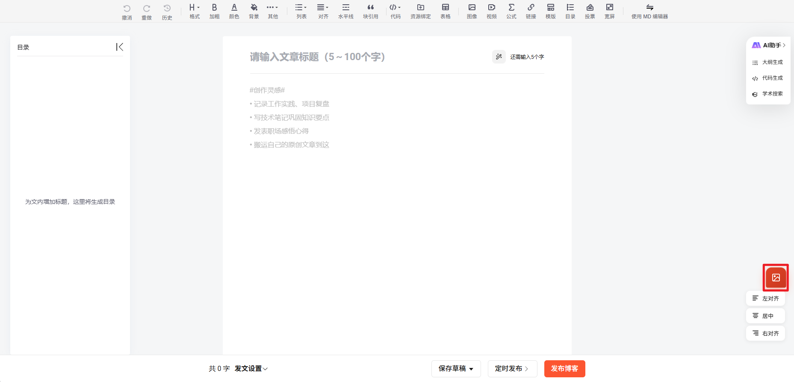

# CSDN 富文本编辑器图片批量对齐工具

一个为 CSDN 富文本编辑器提供批量图片对齐功能的 Tampermonkey 脚本。

## 功能

- **批量左对齐**：一键将编辑器中的所有图片设置为左对齐
- **批量居中**：一键将编辑器中的所有图片设置为居中对齐
- **批量右对齐**：一键将编辑器中的所有图片设置为右对齐
- **实时反馈**：操作成功后显示处理图片数量
- **悬浮按钮**：精美的悬浮按钮设计，不干扰编辑体验

## 安装

1. 安装 [Tampermonkey](https://www.tampermonkey.net/) 浏览器扩展
2. 点击 [安装脚本](./csdn-img-align.user.js)
3. 访问 CSDN 文章编辑页面即可使用

## 使用

1. 点击页面右下角的悬浮按钮打开菜单
2. 选择需要的对齐方式（左对齐/居中/右对齐）
3. 脚本会自动处理编辑器中的所有图片

## 预览

| 悬浮按钮 | 
|---------|
|  |

## 兼容性

- 浏览器：Chrome、Firefox、Edge、Safari
- 目标页面：https://mp.csdn.net/mp_blog/creation/editor*

## 贡献

欢迎提交 Issue 和 Pull Request！

## 许可证

[MIT License](./LICENSE)

## 作者

YiXuan